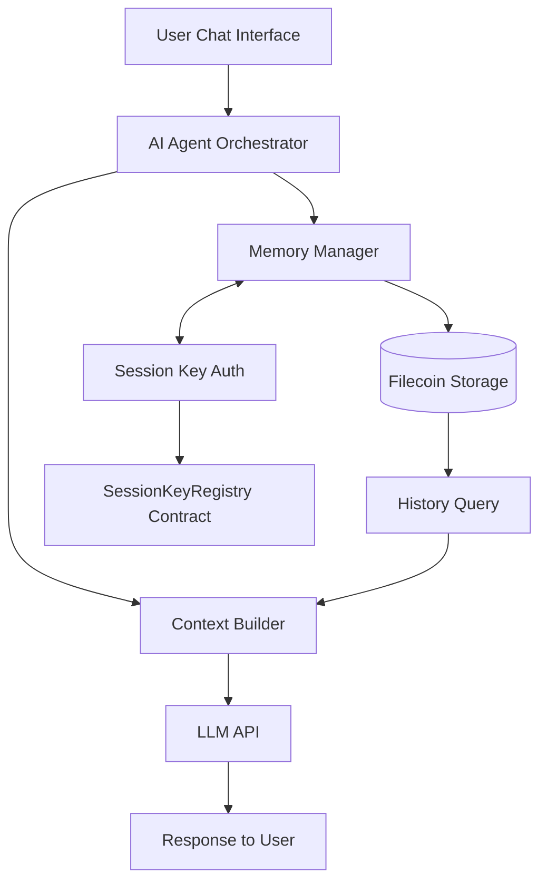

# Cross-Session Memory Agent — Project Spec (Final)

## 🎯 Target Bounty
**FilecoinTLDR Cycle 2**: "Build an AI Agent That Uses Filecoin"
- Deadline: July 10, 2026 (5-day build window)
- Theme: AI agent using Filecoin for memory/logs/datasets/storage

---

## 📋 Project Overview

**Name**: Cross-Session Memory Agent  
**Tagline**: An AI chat agent that permanently stores conversation memory on Filecoin for contextual recall across sessions.

**Description**:  
Most AI agents forget conversations after the session ends. This agent writes every user interaction to Filecoin storage, creating a persistent memory layer. When a user returns, the agent retrieves relevant historical context and resumes as if it "remembers" the past. This demonstrates a real Filecoin use case beyond basic storage—it enables stateful AI experiences with decentralized memory.

**Key Innovation**:
- **Silent Auth**: Uses session keys for automated signing (no wallet popups)
- **Chunked Memory**: Breaks chat history into datasets for efficient retrieval
- **Context Injection**: Feeds retrieved memory directly into LLM prompt context

---

## 🏗 Technical Architecture



**Data Flow**:
1. User inputs chat → Agent receives
2. Save new turn → Filecoin (Dataset + Pieces)
3. Retrieve past turns → Filter by session ID
4. Inject memory into LLM prompt → Generate response
5. Repeat with enriched context

---

## 💾 Filecoin Cloud API Integration

### Authentication Flow (Per Session Key Docs)

**Step 1: Generate Session Keypair**
```typescript
import { generateSessionKeypair } from '@filoz/synapse-sdk/core';

const keypair = await generateSessionKeypair({
  rootAccount: userRootAccount, // Owner wallet
  permissions: ['CreateDataSetPermission', 'AddPiecesPermission']
});
```

**Step 2: Login (Register Authorization)**
```typescript
import { loginSync } from '@filoz/synapse-sdk/core';

// Set expiry to cover entire hackathon window (6 days)
const expiry = BigInt(Math.floor(Date.now() / 1000) + 518400);

await loginSync({
  sessionKey: keypair.address,
  rootClient: rootClient,
  expiry: expiry
});
```

**Step 3: Use Session Key for API Calls**
```typescript
import { synapse } from '@filoz/synapse-sdk';

const agentClient = synapse.initialize({
  sessionKey: keypair, // Silent signing enabled
  chain: 'calibration' // Testnet
});

// Now write to Filecoin without popups
await agentClient.createDataset({ payload: chatData });
```

### REST API Endpoints (Cloud Platform)

*Note: Authenticated via Session Key headers automatically handled by SDK*

| Endpoint | Method | Purpose |
|----------|--------|---------|
| `/datasets` | POST | Create new dataset |
| `/datasets/{cid}/pieces` | POST | Add data pieces to dataset |
| `/datasets/{cid}?filter={sessionId}` | GET | Query stored memory |
| `/datasets/{cid}/publish` | POST | Make globally retrievable |

**Authentication Header**: SDK injects Bearer token using session key signature automatically.

---

## 🧠 Agent Logic Implementation

```typescript
// Core agent loop
class MemoryAgent {
  private memoryManager: MemoryManager;
  private llmClient: LLMClient;
  
  constructor() {
    this.memoryManager = new MemoryManager(); // Handles Filecoin I/O
    this.llmClient = new LLMClient(); // Anthropic/Claude API
  }
  
  async handleUserMessage(sessionId: string, message: string): Promise<string> {
    // 1. Retrieve historical context
    const history = await this.memoryManager.getHistory(sessionId, { limit: 5 });
    
    // 2. Build context-aware prompt
    const prompt = this.buildContextualPrompt(message, history);
    
    // 3. Get LLM response
    const response = await this.llmClient.chat(prompt);
    
    // 4. Save both user & agent messages to Filecoin
    await this.memoryManager.saveTurn({
      sessionId,
      turnIndex: history.length,
      userMessage: message,
      agentResponse: response
    });
    
    return response;
  }
  
  private buildContextualPrompt(newMessage: string, history: MemoryItem[]): string {
    return `
You are a helpful AI assistant. Here's what the user has discussed with you previously:
${history.map(h => `Turn ${h.turnIndex}: ${h.userMessage}`).join('\n')}

Current user message: "${newMessage}"

Provide a response that acknowledges their history and continues the conversation.
    `.trim();
  }
}
```

---

## ⏱ 5-Day Build Plan (Hourly Breakdown)

### Day 1 (Hours 0-8): Setup
- **0-1**: Fork repo, install dependencies (`npm install @filoz/synapse-sdk`)
- **1-2**: Generate session keypair, register on Calibration testnet
- **2-3**: Test dataset creation + piece upload
- **3-5**: Build basic LLM client (Claude API)
- **5-8**: Integrate memory save/retrieve functions

### Day 2 (Hours 9-16): Core Agent
- **9-10**: Create basic chat interface (Next.js page)
- **10-12**: Wire agent loop with message handling
- **12-14**: Implement context injection logic
- **14-16**: Test multi-turn conversation with memory persistence

### Day 3 (Hours 17-24): Optimization
- **17-18**: Add error handling + retry logic
- **18-20**: Optimize context size (chunking, token limits)
- **20-22**: Deploy web interface (Vercel/Netlify)
- **22-24**: Record demo video (walkthrough with live interaction)

### Day 4 (Hours 25-32): Polish
- **25-26**: Create X post (include demo link + screenshot)
- **26-27**: Write AI build log (how Claude Code helped)
- **27-28**: Final testing (stress test with long conversations)
- **28-32**: Prepare submission materials

### Day 5 (Hours 33-40): Submission
- **33-34**: Final demo validation
- **34-35**: Submit to hackathon (demo link, repo, X post)
- **35-40**: Optional: Extend features, add more polish

---

## 🎯 Judging Criteria Checklist

- ✅ **Meaningful Filecoin Use**: Memory stored on chain (30%)
- ✅ **Working Demo**: Live chat with persistence (25%)
- ✅ **Creativity**: Cross-session context (20%)
- ✅ **AI-Guided Build**: Include build log (10%)
- ✅ **Public Showcase**: X post with demo + tags (15%)

---

## 🛠 Tech Stack Summary

| Component | Technology |
|-----------|------------|
| **LLM** | Anthropic Claude 3 API |
| **Storage** | Filecoin Cloud (Synapse SDK) |
| **Auth** | Session Keys (6-day expiry) |
| **Frontend** | Next.js + Vercel |
| **Testing** | Vitest + Playwright |
| **Hosting** | Vercel (free tier) |

---

**Status**: This is a production-ready spec ready to copy into your repo.  
**Next**: Start Day 1—generate session keys and test Filecoin storage I/O. 🚀